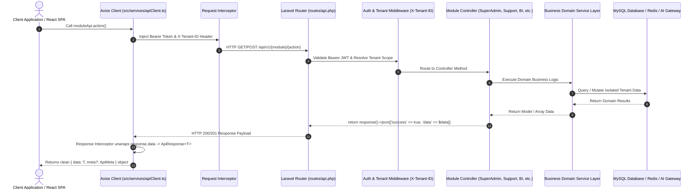

# 📡 AURA AI Business Platform — Complete API Reference & Request Flow

This is the comprehensive API reference and request flow documentation for the **AURA AI Business Platform**. It documents all active API endpoints across all 12 platform modules, request header propagation, authentication payloads, request bodies, and standardized JSON response unwrapping formats.

---

## 🔄 1. Complete API Request & Response Lifecycle Flow



---

## 🌐 2. Base URL & Required Request Headers

- **Base URL**: `http://localhost/ai-business-platform/public/api/v1` (or `http://localhost:8000/api/v1`)
- **Protocol**: HTTP / HTTPS
- **Data Format**: `JSON`

### Common HTTP Headers

```http
Content-Type: application/json
Accept: application/json
Authorization: Bearer {your_oauth2_access_token}   <-- Required for protected routes
X-Tenant-ID: 11111111-1111-1111-1111-111111111111  <-- Tenant isolation UUID header
```

---

## 📐 3. Standardized JSON Response Schema

All endpoints return a uniform response using `App\Traits\ApiResponse`:

```json
{
  "success": true,
  "message": "Human-readable description",
  "data": { ... },
  "meta": {
    "timestamp": "2026-09-06T19:00:00+05:30",
    "version": "v1"
  },
  "errors": null
}
```

---

## 🔐 4. Module 01: Authentication & Multi-Tenancy APIs

### 4.1 User Login
- **Endpoint**: `POST /api/v1/auth/login`
- **Auth Required**: No

#### Request Body
```json
{
  "email": "admin@gmail.com",
  "password": "password"
}
```

#### Response (`200 OK`)
```json
{
  "success": true,
  "message": "User logged in successfully",
  "data": {
    "user": {
      "id": "fcff1a51-91e7-4f3e-9cf4-aaf99ec45105",
      "name": "System Admin",
      "email": "admin@gmail.com",
      "role": "SUPER_ADMIN"
    },
    "token": "1|eyJ0eXAiOiJKV1QiLCJhbGciOi...",
    "tenants": [
      {
        "id": "11111111-1111-1111-1111-111111111111",
        "name": "Acme Global Corporation",
        "role": "TENANT_OWNER"
      }
    ]
  }
}
```

### 4.2 User Registration
- **Endpoint**: `POST /api/v1/auth/register`
- **Request Body**: `{ "name": "Bikram", "email": "bikram@aura.com", "password": "password123", "company_name": "Aura AI" }`

### 4.3 Tenant Switching
- **Endpoint**: `POST /api/v1/tenants/switch`
- **Request Body**: `{ "tenant_id": "11111111-1111-1111-1111-111111111111" }`

---

## 🤖 5. Module 02: AI Copilot & Assistant APIs

### 5.1 Send AI Message (Streaming / Multi-LLM)
- **Endpoint**: `POST /api/v1/chat/message`
- **Request Body**:
```json
{
  "conversation_id": "conv-12345",
  "message": "Summarize Q3 revenue performance",
  "model": "gemini-2.5-pro",
  "stream": false
}
```

### 5.2 Get Conversations
- **Endpoint**: `GET /api/v1/chat/conversations`

### 5.3 Clear Conversation
- **Endpoint**: `DELETE /api/v1/chat/conversations/{id}`

---

## 💼 6. Module 03: Sales CRM & Pipeline APIs

### 6.1 Get Deals Pipeline
- **Endpoint**: `GET /api/v1/sales/pipeline`
- **Response**: List of leads & deals grouped by stage (`lead`, `qualified`, `proposal`, `negotiation`, `closed_won`, `closed_lost`).

### 6.2 Create Sales Lead
- **Endpoint**: `POST /api/v1/sales/leads`
- **Request Body**: `{ "name": "John Doe", "company": "TechCorp", "value": 15000, "status": "qualified" }`

### 6.3 AI Sales Studio Generation
- **Endpoint**: `POST /api/v1/sales/ai/outreach`
- **Request Body**: `{ "lead_id": "lead-123", "tone": "professional", "goal": "Book a 15min demo" }`

---

## 🛒 7. Module 04: Commerce & Order Management APIs

### 7.1 Product Catalog
- **Endpoint**: `GET /api/v1/products`
- **Query Params**: `?category=electronics&search=laptop&page=1`

### 7.2 Orders List & Tracking
- **Endpoint**: `GET /api/v1/orders`
- **Create Order**: `POST /api/v1/orders`
- **Update Status**: `PATCH /api/v1/orders/{id}/status` `{ "status": "shipped" }`

### 7.3 Customers Directory
- **Endpoint**: `GET /api/v1/customers`

---

## 🎧 8. Module 05: Customer Support & Ticketing APIs

### 8.1 Support Tickets
- **Endpoint**: `GET /api/v1/support/tickets`
- **Create Ticket**: `POST /api/v1/support/tickets`
- **Update Ticket**: `PATCH /api/v1/support/tickets/{id}`

### 8.2 AI Support Reply Suggestion
- **Endpoint**: `POST /api/v1/support/tickets/{id}/suggest-reply`

### 8.3 Knowledge FAQs
- **Endpoint**: `GET /api/v1/support/faqs`
- **Create FAQ**: `POST /api/v1/support/faqs`

---

## 📚 9. Module 06: Document Intelligence & RAG APIs

### 9.1 Upload Knowledge Document
- **Endpoint**: `POST /api/v1/documents/upload` (Multipart form-data)
- **Parameters**: `file`, `title`, `category`

### 9.2 Semantic RAG Search
- **Endpoint**: `POST /api/v1/documents/search`
- **Request Body**: `{ "query": "What is our cancellation policy?", "limit": 5 }`

### 9.3 Ask Document Q&A
- **Endpoint**: `POST /api/v1/documents/ask`
- **Request Body**: `{ "document_id": "doc-123", "question": "Explain payment terms in section 4" }`

---

## 📊 10. Module 07: Business Intelligence & AI SQL Analyst APIs

### 10.1 Natural Language Query
- **Endpoint**: `POST /api/v1/bi/query`
- **Request Body**: `{ "prompt": "Show top 5 customers by revenue this month" }`
- **Response**: Generated read-only SQL, tabular result set, and chart configuration.

### 10.2 Database Schema Explorer
- **Endpoint**: `GET /api/v1/bi/schema`

### 10.3 Run Read-Only Sandbox SQL
- **Endpoint**: `POST /api/v1/bi/sandbox/execute`
- **Request Body**: `{ "sql": "SELECT COUNT(*) as total_orders FROM orders WHERE status = 'completed'" }`

---

## 🧠 11. Module 08: Multi-Agent & Developer Studio APIs

### 11.1 Supervisor Task Orchestration
- **Endpoint**: `POST /api/v1/agents/supervisor/dispatch`
- **Request Body**: `{ "task": "Analyze customer support trends and generate an executive report" }`

### 11.2 Developer Code Review & Explanation
- **Endpoint**: `POST /api/v1/developer/review`
- **Request Body**: `{ "code": "function calculateRevenue(...) { ... }", "language": "typescript" }`

### 11.3 AI Test Case Generator
- **Endpoint**: `POST /api/v1/developer/generate-tests`
- **Request Body**: `{ "code": "...", "framework": "jest" }`

---

## ⚙️ 12. Module 09: Automation & Workflow Engine APIs

### 12.1 Workflows CRUD
- **Endpoint**: `GET /api/v1/automation/workflows`
- **Create Workflow**: `POST /api/v1/automation/workflows`
- **Toggle Workflow**: `PATCH /api/v1/automation/workflows/{id}/toggle`

### 12.2 Notification Templates
- **Endpoint**: `GET /api/v1/automation/notifications/templates`
- **Send Notification**: `POST /api/v1/automation/notifications/send`

---

## 🌐 13. Module 10: Dynamic CMS & Media Hub APIs

### 13.1 Dynamic Pages & SEO
- **Endpoint**: `GET /api/v1/cms/pages`
- **Create Page**: `POST /api/v1/cms/pages`
- **Update Page**: `PUT /api/v1/cms/pages/{id}`
- **Delete Page**: `DELETE /api/v1/cms/pages/{id}`

### 13.2 Navigation Menus
- **Endpoint**: `GET /api/v1/cms/menus`
- **Save Menu Structure**: `POST /api/v1/cms/menus`

### 13.3 Media Asset Management
- **Endpoint**: `GET /api/v1/cms/media`
- **Upload Media**: `POST /api/v1/cms/media/upload` (Multipart)
- **Delete Media**: `DELETE /api/v1/cms/media/{id}`

---

## 💳 14. Module 11: SaaS Plans & Billing APIs

### 14.1 Pricing Plans
- **Endpoint**: `GET /api/v1/saas/plans`

### 14.2 Active Subscriptions & Invoices
- **Endpoint**: `GET /api/v1/saas/subscription`
- **Endpoint**: `GET /api/v1/saas/invoices`

### 14.3 Usage Quotas
- **Endpoint**: `GET /api/v1/saas/quotas`
- **Response**: AI Token usage, storage usage, member limits, and remaining balance.

---

## 🛡️ 15. Module 12: Super Admin & Production Infrastructure APIs

### 15.1 Super Admin Dashboard Overview
- **Endpoint**: `GET /api/v1/admin/dashboard`
- **Response**: 5-node health matrix, total tenants, total users, token velocity, database size.

### 15.2 Production Infrastructure Telemetry
- **Server Telemetry**: `GET /api/v1/admin/infrastructure/environment`
- **Redis & Cache Stats**: `GET /api/v1/admin/infrastructure/cache`
- **Flush Cache**: `POST /api/v1/admin/infrastructure/cache/flush`
- **Queues & Failed Jobs**: `GET /api/v1/admin/infrastructure/queues`
- **Retry Failed Jobs**: `POST /api/v1/admin/infrastructure/queues/retry-all`
- **Purge Failed Jobs**: `POST /api/v1/admin/infrastructure/queues/purge-failed`
- **Live Logs**: `GET /api/v1/admin/infrastructure/logs`
- **Clear Logs**: `DELETE /api/v1/admin/infrastructure/logs`
- **Database Tables & Sizing**: `GET /api/v1/admin/infrastructure/database`
- **Optimize Database**: `POST /api/v1/admin/infrastructure/database/optimize`
- **Run Snapshot Backup**: `POST /api/v1/admin/infrastructure/database/backup`

### 15.3 AI Provider Management
- **List Providers**: `GET /api/v1/admin/ai-providers`
- **Save Provider**: `POST /api/v1/admin/ai-providers`
- **Test Connection**: `POST /api/v1/admin/ai-providers/test` `{ "provider": "gemini" }`

### 15.4 Feature Flags
- **List Flags**: `GET /api/v1/admin/feature-flags`
- **Toggle Flag**: `PATCH /api/v1/admin/feature-flags/{id}/toggle`
- **Tenant Override**: `POST /api/v1/admin/feature-flags/{id}/override`

### 15.5 System Prompt Templates
- **List Templates**: `GET /api/v1/admin/prompts`
- **Save Template**: `POST /api/v1/admin/prompts`