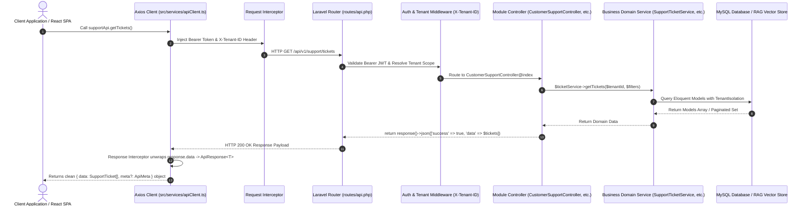

# 📡 AURA AI Business Platform — Complete API Reference & Request Flow

This is the comprehensive API reference and request flow documentation for the **AURA AI Business Platform**. It documents all active API endpoints, request header propagation, authentication payloads, request bodies, and standardized JSON response unwrapping formats.

---

## 🔄 1. Complete API Request & Response Lifecycle Flow



---

## 🌐 2. Base URL & Required Request Headers

- **Base URL**: `http://localhost:8000/api/v1`
- **Protocol**: HTTP / HTTPS
- **Data Format**: `JSON`

### Common HTTP Headers

```http
Content-Type: application/json
Accept: application/json
Authorization: Bearer {your_oauth2_access_token}   <-- Required for protected routes
X-Tenant-ID: 11111111-1111-1111-1111-111111111111  <-- Tenant isolation UUID header
```

---

## 📐 3. Standardized JSON Response Schema

All endpoints return a uniform response using `App\Traits\ApiResponse`:

```json
{
  "success": true,
  "message": "Human-readable description",
  "data": { ... },
  "meta": {
    "timestamp": "2026-09-01T22:40:00+05:30",
    "version": "v1"
  },
  "errors": null
}
```

> **Client Unwrapping Rule**: In `apiClient.ts`, `apiClient.get(...)` returns `response.data` (which IS the `ApiResponse<T>` wrapper object containing `.success`, `.data`, `.message`). API callers in modules access `res.data` directly to get `T`.

---

## 🔐 4. Authentication & Profile APIs

### 4.1 User Login
- **Endpoint**: `POST /api/v1/auth/login`
- **Auth Required**: No

#### Request Body
```json
{
  "email": "admin@gmail.com",
  "password": "password"
}
```

#### Response Payload (`200 OK`)
```json
{
  "success": true,
  "message": "User logged in successfully",
  "data": {
    "user": {
      "id": "fcff1a51-91e7-4f3e-9cf4-aaf99ec45105",
      "name": "System Admin",
      "email": "admin@gmail.com",
      "role": "SUPER_ADMIN",
      "status": "ACTIVE"
    },
    "token": "eyJ0eXAiOiJKV1QiLCJhbGciOiJSUzI1NiJ9..."
  }
}
```

---

## 🎧 5. Module 10: Customer Support Agent Suite APIs

### 5.1 List Support Tickets
- **Endpoint**: `GET /api/v1/support/tickets`
- **Auth Required**: Yes (`Bearer {token}`)
- **Query Params**: `search`, `status`, `priority`, `category`, `per_page`

#### Response Payload (`200 OK`)
```json
{
  "success": true,
  "message": "Support tickets retrieved successfully.",
  "data": [
    {
      "id": "8c57394b-0795-4948-9ee9-ef0fb0e34eb1",
      "ticket_number": "TCK-882194",
      "subject": "Delayed Order Dispatch #ORD-99120",
      "category": "Shipping",
      "priority": "HIGH",
      "status": "OPEN",
      "sentiment_score": 0.85,
      "sentiment_label": "Frustrated",
      "sla_due_at": "2026-09-02T10:00:00.000000Z",
      "customer": {
        "id": "c1111111-1111-1111-1111-111111111111",
        "name": "Bikram Singh",
        "email": "bikram@example.com"
      }
    }
  ]
}
```

---

### 5.2 Create Support Ticket
- **Endpoint**: `POST /api/v1/support/tickets`
- **Auth Required**: Yes (`Bearer {token}`)

#### Request Body
```json
{
  "subject": "Cannot download tax invoice PDF",
  "description": "Clicking download invoice throws 404 error",
  "category": "Billing",
  "priority": "MEDIUM"
}
```

---

### 5.3 Generate Grounded AI Response
- **Endpoint**: `POST /api/v1/support/tickets/{id}/ai-respond`
- **Auth Required**: Yes (`Bearer {token}`)

#### Request Body
```json
{
  "query": "Where is my shipment?"
}
```

#### Response Payload (`200 OK`)
```json
{
  "success": true,
  "message": "AI support response generated.",
  "data": {
    "message": "Hello Bikram, your order #ORD-99120 was shipped via FedEx tracking #FX-881920 and is scheduled for delivery tomorrow.",
    "confidence_score": 0.96
  }
}
```

---

### 5.4 AI Sentiment Analysis & Ticket Classification
- **Endpoint**: `POST /api/v1/support/tickets/{id}/analyze`
- **Auth Required**: Yes (`Bearer {token}`)

#### Response Payload (`200 OK`)
```json
{
  "success": true,
  "message": "Ticket analyzed successfully.",
  "data": {
    "category": "Shipping",
    "priority": "HIGH",
    "sentiment_score": 0.88,
    "sentiment_label": "Frustrated",
    "key_issues": ["Package delayed", "Tracking update missing"]
  }
}
```

---

### 5.5 AI Smart Reply Suggestions
- **Endpoint**: `GET /api/v1/support/tickets/{id}/suggest-responses`
- **Auth Required**: Yes (`Bearer {token}`)

#### Response Payload (`200 OK`)
```json
{
  "success": true,
  "message": "Response suggestions generated.",
  "data": [
    "I have checked your shipment #ORD-99120 and updated your delivery status.",
    "Our warehouse has dispatched your replacement package via priority express.",
    "I apologize for the delay; I have issued a \$15 shipping credit to your account."
  ]
}
```

---

### 5.6 Customer 360 Profile Lookup
- **Endpoint**: `GET /api/v1/support/customers/{customerId}/profile`
- **Auth Required**: Yes (`Bearer {token}`)

#### Response Payload (`200 OK`)
```json
{
  "success": true,
  "message": "Customer 360 profile retrieved.",
  "data": {
    "customer": {
      "id": "c1111111-1111-1111-1111-111111111111",
      "name": "Bikram Singh",
      "email": "bikram@example.com",
      "total_spent": 1499.50
    },
    "recent_orders": [...],
    "tickets": [...]
  }
}
```

---

### 5.7 Order Lookup Workbench
- **Endpoint**: `GET /api/v1/support/lookup-order?query=Bikram`
- **Auth Required**: Yes (`Bearer {token}`)

#### Response Payload (`200 OK`)
```json
{
  "success": true,
  "message": "Orders lookup completed.",
  "data": [
    {
      "id": "8c57394b-0795-4948-9ee9-ef0fb0e34eb1",
      "order_number": "ORD-99120",
      "total_amount": "499.00",
      "status": "PAID",
      "customer": {
        "id": "c1111111-1111-1111-1111-111111111111",
        "name": "Bikram Singh",
        "email": "bikram@example.com"
      }
    }
  ]
}
```

---

### 5.8 List Support FAQs
- **Endpoint**: `GET /api/v1/support/faqs?category=Billing`
- **Auth Required**: Yes (`Bearer {token}`)

---

### 5.9 Support SLA Telemetry & Analytics
- **Endpoint**: `GET /api/v1/support/analytics`
- **Auth Required**: Yes (`Bearer {token}`)

#### Response Payload (`200 OK`)
```json
{
  "success": true,
  "message": "Support analytics retrieved.",
  "data": {
    "total_tickets": 4,
    "open_tickets": 3,
    "resolved_tickets": 1,
    "sla_compliance_rate": 98.4,
    "avg_first_response_time_minutes": 14.2,
    "resolution_rate": 25.0,
    "sentiment_breakdown": {
      "Positive": 1,
      "Neutral": 1,
      "Frustrated": 1,
      "Urgent": 1
    }
  }
}
```

---

## 🔐 6. Tenant Isolation & Governance APIs

### 6.1 Provision Company Tenant
- **Endpoint**: `POST /api/v1/tenants`
- **Auth Required**: Yes (`Bearer {token}`)

### 6.2 Switch Active Tenant
- **Endpoint**: `POST /api/v1/tenant/switch`
- **Auth Required**: Yes (`Bearer {token}`)