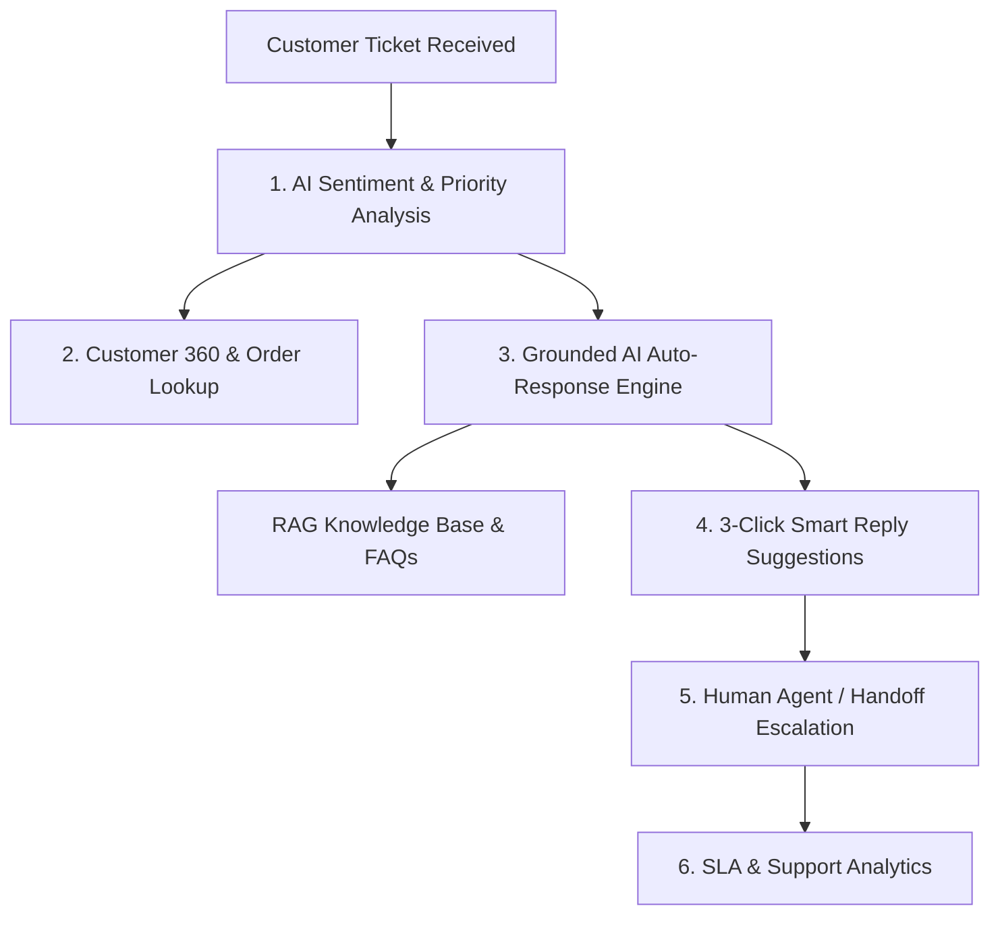
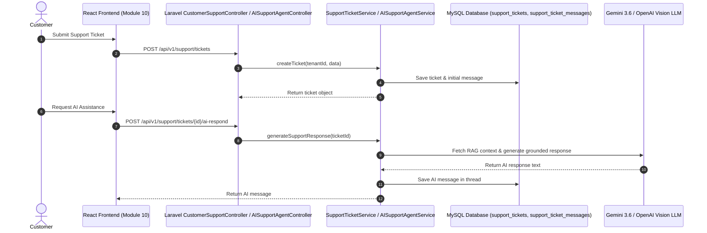

# 🎧 Customer Support Agent — Workflow & Complete Operating Guide

> **Module 10: Customer Support Agent Suite**  
> *Enterprise AI-Powered Ticketing, Grounded Auto-Replies, Customer 360 Telemetry, SLA Tracking & Sentiment Analytics*

---

## 📌 Executive Summary

The **Customer Support Agent Suite** (Module 10) empowers support teams, managers, and enterprise organizations to deliver rapid, empathetic, and intelligent customer service. It combines **Retrieval-Augmented Generation (RAG)** with real-time order history, customer profiles, and FAQ knowledge to automate resolutions and assist human agents.

---

## 🚀 5 Core Feature Workflows

### 1. 📬 Support Inbox & Interactive Conversation Thread
- **Purpose**: Centralized inbox for managing incoming customer support requests across web apps, emails, and customer portals.
- **Key Capabilities**:
  - **Filter & Search**: Instant filtering by Status (`OPEN`, `IN_PROGRESS`, `WAITING`, `RESOLVED`, `CLOSED`), Priority (`URGENT`, `HIGH`, `MEDIUM`, `LOW`), or Category (`Billing`, `Technical`, `Shipping`, `Account`).
  - **SLA Due Countdown**: Displays real-time SLA deadline badges (e.g. 2h target for Urgent, 6h for High, 24h for Medium).
  - **Sentiment Badges**: Live AI sentiment tags (`😡 Frustrated`, `🚨 Urgent`, `😊 Positive`, `😐 Neutral`) with percentage scores.
  - **Thread History**: Unified chronological timeline recording customer messages, AI agent responses, human staff replies, and system handoff notices.

---

### 2. 👤 Customer 360 Profile & Order Lookup
- **Purpose**: Provides support agents with complete 360-degree customer context so they never have to ask repetitive questions.
- **Key Capabilities**:
  - **Purchase History**: Instant view of recent orders, total dollars spent, and order status (`PAID`, `SHIPPED`, `DELIVERED`, `PENDING`).
  - **Customer Telemetry**: Shows email, phone, company, registration date, active tickets count, and internal notes.
  - **Order Lookup Workbench**: Search any order by Order Number (e.g., `#TCK-882194`), email, or customer name to inspect line items and shipping addresses instantly.

---

### 3. 🤖 Grounded AI Support Agent & Auto-Response Studio
- **Purpose**: Automatically generates accurate, polite, and grounded support replies using verified organization knowledge.
- **How Grounded AI Works**:
  1. **Knowledge Retrieval**: Looks up related information in Module 06 (RAG Knowledge Base & Document Intelligence).
  2. **FAQ Ingestion**: Scans published FAQs for matching business rules.
  3. **Order Alignment**: Injects exact order status, dates, and amounts for the specific customer.
  4. **Empathy & Trust**: Formulates a clear response with 0% hallucination.
- **3-Click Smart Reply Suggestions**: Automatically generates 3 distinct, professional response options for human agents to review and insert with one click.
- **Human Handoff**: Allows agents to escalate sensitive or high-risk tickets to human staff with custom internal escalation notes.

---

### 4. ❓ FAQs & Knowledge Base Management
- **Purpose**: Publish self-service support articles that simultaneously answer customer questions and feed the AI Support Agent's memory.
- **Key Capabilities**:
  - Categorize FAQs under `Billing & Plans`, `Technical Support`, `Security & Privacy`, `Shipping & Delivery`, or `General`.
  - Track article views and helpfulness ratings (`helpful_count`).
  - Publish or unpublish articles dynamically.

---

### 5. 📊 SLA Compliance & Support Analytics Dashboard
- **Purpose**: Executive dashboard providing real-time visibility into customer satisfaction, response speeds, and support team performance.
- **Key Metrics Tracked**:
  - **SLA Compliance Rate**: Percentage of tickets responded to before the SLA deadline (Target: >95%).
  - **Average First Response Time (FRT)**: Average time in minutes before first response.
  - **Resolution Rate**: Percentage of total tickets resolved.
  - **Sentiment Distribution**: Visual breakdown of Customer Sentiment (`Positive`, `Neutral`, `Frustrated`, `Urgent`).
  - **Category Volume**: Distribution of support requests across business departments.

---

## 🛠️ Data Flow & Architecture

---

## 📖 Step-by-Step Operator Guide

### How to Handle a Support Ticket:
1. Navigate to **10. Customer Support Agent > Support Inbox & Tickets** (`/support`).
2. Select a ticket from the left inbox list to open the conversation thread.
3. Click **"Analyze"** to run instant AI sentiment scoring and category classification.
4. Review **AI Smart Reply Suggestions** at the bottom and click any option to populate the reply box.
5. Alternatively, click **"AI Auto-Reply"** to let AURA AI draft a grounded response using your company documents and order records.
6. If the ticket requires human escalation, click **"Escalate (Handoff)"** to assign it to senior staff.
7. Change status to **`RESOLVED`** once the customer's issue is satisfied.

---

## 🛡️ Multi-Tenant Security & Privacy

- **Tenant Isolation**: Every ticket, message, customer profile, and FAQ is strictly scoped by `tenant_id`.
- **Data Protection**: Customer conversation logs and order details are never used to train public foundation AI models.
- **RBAC Control**: Access permissions are governed by role capabilities (`customer.view`, `ticket.view`, `ticket.manage`).
