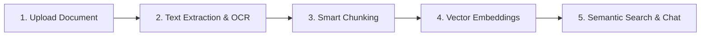

# 📚 RAG & Document Intelligence Suite — Plain English Guide

## 🌟 What is this Module? (In Simple Words)

The **RAG & Document Intelligence Module** is your company's **intelligent digital brain and AI document assistant**. 

Instead of reading hundreds of pages of PDF contracts, Word documents, Excel sheets, invoices, or scanned receipts manually:
1. You **upload your company files** (PDF, DOCX, CSV, TXT, or Images).
2. The system **reads and indexes every sentence** using AI vector embeddings.
3. You can **ask any question**, and the AI answers instantly with **exact source proof (page number, chunk, and document name)**.
4. You can also **extract structured data** (e.g., due dates, payment terms, clauses), **classify documents**, and **compare two documents side-by-side** to spot changes.

---

## 🎯 What Problems Does It Solve?

| Before Document Intelligence | With Document Intelligence |
| :--- | :--- |
| Spending hours searching for a clause in a 60-page PDF contract | Ask AI in chat and get the exact paragraph in 2 seconds |
| Manually retyping data from invoices, CSVs, or receipts into the system | Automated OCR & JSON schema extraction directly to database |
| Unsure if the AI answer is made up (hallucination) | Every answer includes clickable citations with source preview & page number |
| Comparing two document revisions manually word-by-word | AI Document Comparison highlights differences, risk factors, and omitted terms |
| Files scattered across email threads and messy desktop folders | Centralized hierarchical folders with tenant isolation and permission controls |

---

## 🚀 5 Core Feature Studios

### 1. 📁 Knowledge Base & Folder Management
- **Hierarchical Folders**: Organize files into folders (e.g., *Legal*, *Finance*, *HR*, *Engineering*, *Operations*).
- **Format Support**: Handles `.pdf`, `.docx`, `.doc`, `.txt`, `.csv`, `.json`, `.md`, and `.png/.jpg` image scans.
- **OCR (Optical Character Recognition)**: Automatically reads printed and handwritten text inside scanned receipts, invoices, and diagrams.
- **Version Tracking**: Maintains version history (`v1.0`, `v1.1`, `v2.0`) whenever a document is revised.

### 2. 💬 Multi-Document AI Chat & Q&A
- **Scope Selection**: Chat with your *entire knowledge base* or *select specific documents* (e.g., only "Vendor Contract 2026").
- **Grounded Verification**: The AI answers strictly using verified facts from your uploaded files.
- **Source Badges**: Every sentence is backed by clickable citations showing the document title, page number, and similarity score.

### 3. 🔍 RAG Hybrid Search Workbench
- **Semantic Vector Search**: Finds content by *meaning* and *concept*, even if you don't use the exact keywords (e.g., searching "termination rules" finds clauses containing "cancellation and exit procedure").
- **Sparse Keyword Search**: Instant exact term matching for specific codes, SKUs, and IDs.
- **Hybrid Search (RRF)**: Combines Semantic + Keyword search using Reciprocal Rank Fusion for high search precision.
- **Custom Sliders**: Adjust Top-K matches (1 to 15) and minimum similarity score threshold (0.1 to 0.8).

### 4. 🧠 Document Intelligence & Structured Extraction
- **Executive Summarizer**: Generates 2-3 paragraph executive overviews, key takeaways, and action items in one click.
- **Structured Schema Extractor (JSON)**: Converts unformatted contract text into clean JSON (e.g., `effective_date`, `parties_involved`, `contract_value`, `expiration_date`).
- **AI Category Classifier**: Automatically categorizes files into Legal, Finance, HR, Technical, or Operations.
- **Document Comparison Engine**: Compares two documents or versions side-by-side to highlight clause modifications, risk factors, and deletions.

### 5. 📊 Vector Analytics & Audit Trail
- **Knowledge Metrics**: Live counts of total vector chunks, embedded words, token consumption, and storage usage.
- **Audit Log Trail**: Logs every search, chat query, ingestion job, processing latency, and user event.
- **Failed Job Retry**: One-click retry and re-indexing if any file fails during ingestion.

---

## 📁 What is "Folder Destination"? (How to Create & Where Data Comes From)

### ❓ What is Folder Destination?
**Folder Destination** is the target directory/category inside your company's Knowledge Base where your uploaded document will be organized (for example: `📁 Vendor Contracts 2026`, `📁 Technical Architecture`, `📁 HR Policies & Benefits`, or `Root Knowledge Base` if you prefer no folder).

### 🔍 Where Does This Data Come From?
- All folders are saved in your company's tenant-isolated database table: `document_folders`.
- The upload modal automatically calls `GET /api/v1/folders` to fetch the list of existing folders for your company.

### 🛠️ How to Create a New Folder (Step-by-Step):
1. Navigate to **06. RAG & Document Intelligence** → **Knowledge Base & Files** in the sidebar.
2. In the left panel titled **"Folders & Hierarchy"**, click the **`+` (New Folder)** button in the top-right corner.
3. Enter your **Folder Name** (e.g. *"Client Agreements 2026"*).
4. Pick an **Accent Color** (Indigo, Pink, Emerald, Amber, Cyan, or Violet).
5. Click **"Create"**.
6. The new folder will immediately show up in the **Folder Destination** dropdown whenever you upload documents!

---

## ⚙️ How It Works Under The Hood (Simple 5 Steps)

1. **Upload**: You drag-and-drop your files.
2. **Text Extraction & OCR**: The system extracts raw text from PDF streams, Word XML, CSV rows, or OCR vision.
3. **Smart Chunking**: Breaks long documents into structured overlapping windows (~400 words with 50-word overlap) preserving sentence boundaries.
4. **Vector Embeddings**: Converts text chunks into mathematical vectors using Google Gemini `text-embedding-004` (or OpenAI).
5. **Retrieval (RAG)**: When you ask a question, the vector engine finds the closest matching chunks, injects them into the prompt, and generates a grounded response with exact citations.

---

## 🔒 Security & Tenant Isolation
- **Tenant Isolation**: Every document, chunk, vector, and search log is isolated by `tenant_id`. One company can never access another company's knowledge base.
- **Access Permissions**: Control who can view, upload, or delete documents based on user roles (`SUPER_ADMIN`, `TENANT_OWNER`, `MANAGER`, `STAFF`).
- **Storage Options**: Supports local encrypted storage and AWS S3 cloud buckets.
