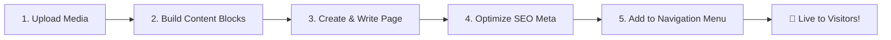

# 🌐 Dynamic CMS & Content Suite — Easy Customer Workflow & Operating Guide

> **Module 10: Dynamic CMS, SEO & Media Asset Management**  
> *A complete, non-technical, easy-to-follow guide for creating pages, optimizing for Google SEO, organizing website menus, and managing digital media.*

---

## 📌 Executive Summary

The **Dynamic Content Management System (CMS)** allows you to effortlessly design, publish, and manage website pages, reusable content blocks, navigation menus, and media assets without touching code.



---

## 🚀 Easy 5-Step Customer Workflow

Follow this simple 5-step path to launch any new page on your website:

```
[ Step 1: Upload Media ] ➡️ [ Step 2: Create Page ] ➡️ [ Step 3: Write & Format Content ] ➡️ [ Step 4: Setup SEO ] ➡️ [ Step 5: Add to Menu ]
```

---

### 🟢 Step 1: Upload Your Images & Assets (Media Manager)
1. In the sidebar, open **10. Dynamic CMS** and click **Media Assets** (`/cms/media`).
2. Click **Upload Media**.
3. Select your image (`.png`, `.jpg`, `.webp`, or `.svg`).
4. Add relevant tags (e.g., `banner`, `product`, `team`) for quick search.
5. Copy the generated media URL to use anywhere across your pages.

---

### 🟢 Step 2: Create a New Page
1. Click **Pages & SEO** (`/cms/pages`) in the sidebar.
2. Click the **+ Create New Page** button at the top right.
3. Enter your page title (e.g., *About Us*, *Summer Sale 2026*, *Pricing*).
4. Select a layout:
   - `Default`: Standard header, content body, and footer.
   - `Full-Width / Landing`: Edge-to-edge layout for marketing campaigns.
   - `Sidebar / Doc`: Left navigation layout for knowledge articles.

---

### 🟢 Step 3: Write & Format Content
1. In the **Content Editor**, write your copy using Markdown or visual headings (`# Heading 1`, `## Heading 2`, bullet lists, bold text).
2. Insert images using standard markdown: ``.
3. Preview your layout in real-time on the right side of the screen.
4. Set status:
   - `Draft`: Only visible to team members.
   - `Published`: Live on your website instantly.

---

### 🟢 Step 4: Configure SEO & Social Share Preview
1. Switch to the **SEO & Meta Settings** tab under the page editor.
2. Fill in:
   - **SEO Meta Title**: Appears in Google Search results tab (50–60 characters).
   - **Meta Description**: Brief summary displayed under your Google link (150–160 characters).
   - **Focus Keywords**: Comma-separated search terms (e.g. `ai analytics, saas platform, business automation`).
   - **Social Share Image (OG Image)**: The thumbnail image displayed when sharing on WhatsApp, Twitter/X, or LinkedIn.
3. Check the live Google search preview card to see how your page will look to searchers.

---

### 🟢 Step 5: Add Page to Navigation Menus
1. Click **Navigation Menus** (`/cms/menus`) in the sidebar.
2. Select the menu you want to update (e.g., **Main Header** or **Footer Links**).
3. Click **+ Add Menu Item**:
   - **Label**: The visible link text (e.g., *About Us*).
   - **Target**: Choose your newly created page or enter an external URL.
   - **Order**: Re-order items up or down to set display order.
4. Click **Save Menu**. Your header or footer navigation updates immediately!

---

## 🌟 Key Features Overview

| Feature | What It Does for You | Customer Benefit |
| :--- | :--- | :--- |
| 📄 **Dynamic Pages** | Visual & Markdown page builder with slug auto-generation | Launch landing pages in under 2 minutes without asking a developer |
| 🔍 **Built-In SEO Suite** | Google snippet preview, meta keywords, OpenGraph sharing | Rank higher on search engines and get more organic traffic |
| 🧩 **Content Blocks** | Modular, reusable UI cards (e.g. Hero Banner, Testimonials, CTA) | Update a contact card once, and it updates across all pages automatically |
| 🧭 **Menu Manager** | Multi-level hierarchical navigation menu builder | Full control over header, footer, and sidebar navigation links |
| 🖼️ **Media Assets Hub** | Cloud storage, automated thumbnailing, tag filtering, and size quotas | Keep all your brand images, logos, and banners organized in one place |
| 🏢 **Multi-Tenant Isolation** | Secure, isolated content workspaces for each organization | Zero risk of content mixing between departments or client accounts |

---

## 💡 Quick "How-To" Guides for Common Scenarios

### How to Create a High-Converting Marketing Landing Page
1. Go to **Pages & SEO** ➔ Click **Create New Page**.
2. Name it `Special Promo Launch`.
3. Select layout: `Landing Page`.
4. Add your hero headline, 3 key benefits in bullet points, and a link to your checkout or contact form.
5. Under SEO, write an exciting Meta Description with a call-to-action (e.g., *"Claim 20% off all enterprise plans this month"*).
6. Toggle Status to **Published** and click **Save Changes**.

---

### How to Add a Dropdown or Link to the Top Navigation Bar
1. Navigate to **Navigation Menus**.
2. Select **Main Header Menu**.
3. Click **Add Item**.
4. Set Title: `Pricing`, URL: `/billing`.
5. Set Position to `3` (to place it between *Features* and *Contact*).
6. Hit **Save**.

---

### How to Update Reusable Footer Contact Information
1. Open **Content Blocks** under CMS.
2. Click on the `global_footer_contact` block.
3. Edit your support email, phone number, or office address.
4. Click **Update Block**. Every page displaying this block updates instantly.

---

## 📊 Summary Checklist Before Publishing

Before marking a page as **Published**, verify:
- [ ] Page Title is clear and concise.
- [ ] High-resolution images are uploaded and tagged in Media Assets.
- [ ] SEO Meta Title & Meta Description are filled in.
- [ ] Focus keywords are added.
- [ ] OpenGraph Social Share image is set.
- [ ] Page is connected to at least one navigation menu (Header or Footer).
- [ ] Page status is set to **Published**.
